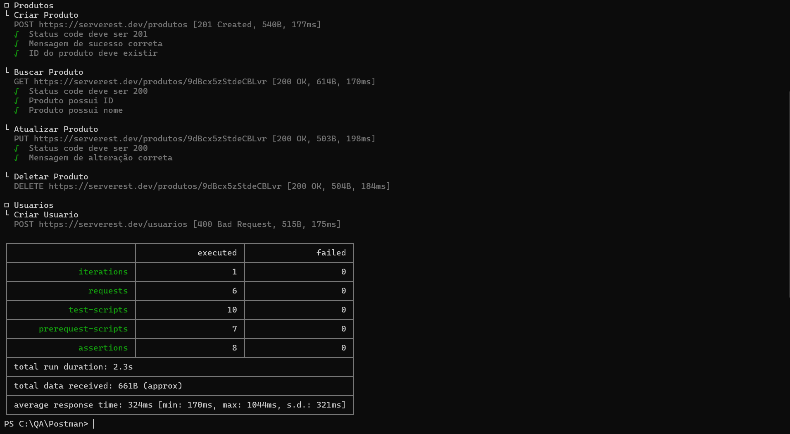
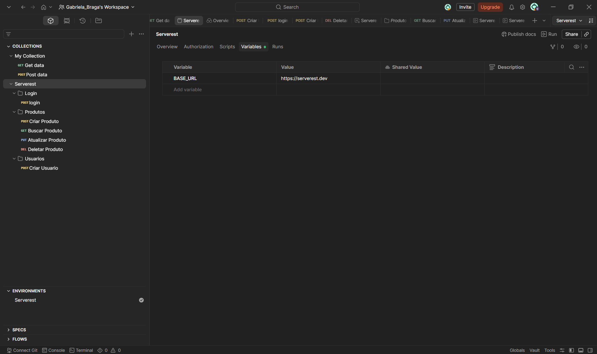
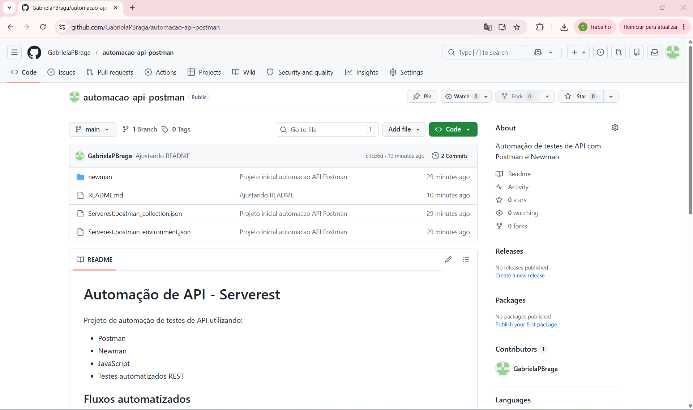

# Automação de API - Serverest

Projeto de automação de testes de API utilizando:

- Postman
- Newman
- JavaScript
- Testes automatizados REST

## Fluxos automatizados

- Login
- Criar Produto
- Buscar Produto
- Atualizar Produto
- Deletar Produto

## Tecnologias

- Postman
- Newman
- Node.js

## Execução dos testes

```bash
newman run Serverest.postman_collection.json -e Serverest.postman_environment.json
```

## Objetivo

Demonstrar conhecimentos em:
- automação de API
- variáveis dinâmicas
- assertions
- fluxo CRUD
- execução automatizada via CLI

## Evidências da execução

### Execução dos testes via Newman



### Collection no Postman



### Projeto publicado no GitHub

